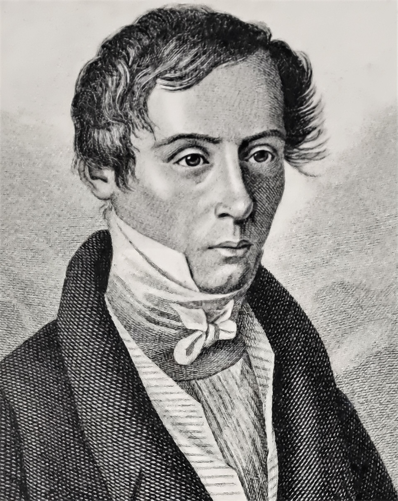
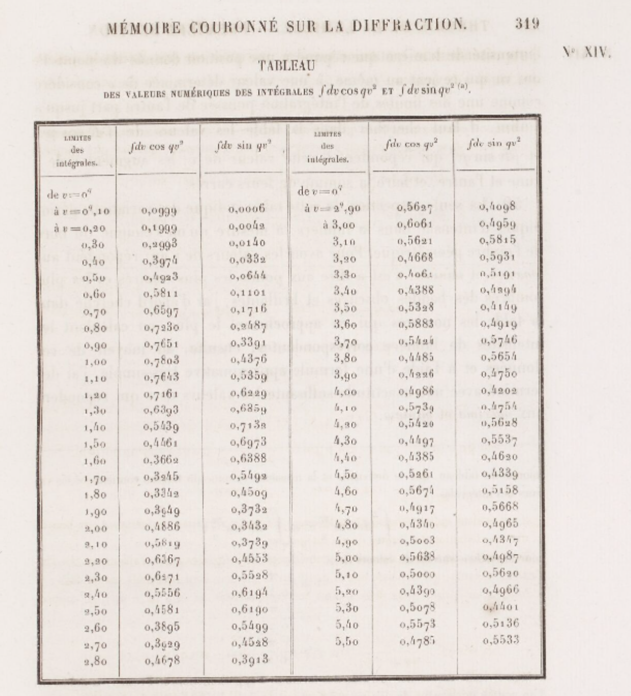
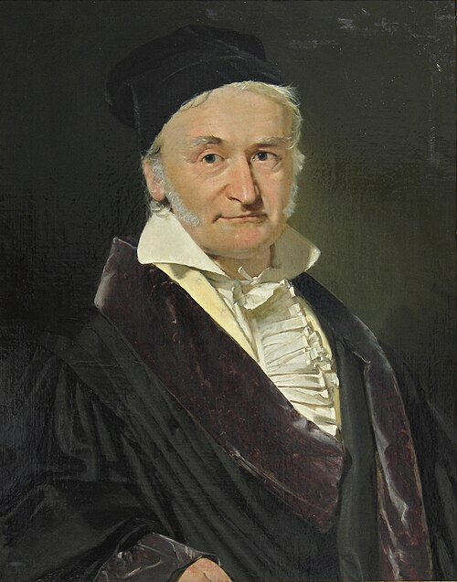

::: {.callout-note}
## Definition
The Gaussian integral, also known as the Euler–Poisson integral, is the integral of the Gaussian function $f(x) = e^{-x^2}$ over the entire real line:

$$\int_{-\infty}^{\infty} e^{-x^2} dx = \sqrt{\pi}$$
:::

## 1. History of the Gaussian Integral {#history}

[Placeholder: The history of the Gaussian integral will be added here.]

---

## 2. Three Ways to $\sqrt{\pi}$ {#three-ways}

This guide explores the evaluation of the classical Gaussian integral. We cover three distinct proof paths, illustrating the concept of "the same result, different approaches."

> $$I = \int_{-\infty}^{\infty} e^{-x^2} \, dx = \sqrt{\pi}$$
> 
> Equivalent to the half-line integral:
> 
> $$\int_{0}^{\infty} e^{-x^2} \, dx = \frac{\sqrt{\pi}}{2}$$

### 2.1. The Polar Coordinate Proof {#polar-proof}
*The classic proof. The one Laplace used in 1812. The one every calculus textbook leads with—and for good reason: once you see it, you never forget it.*

1. **Identify the antiderivative roadblock:**
   We seek to evaluate $I = \int_{-\infty}^{\infty} e^{-x^2}\,dx$. Standard real-variable methods like simple substitution or integration by parts fail to yield progress because $e^{-x^2}$ has no elementary antiderivative (a fact proved by Joseph Liouville in 1835). To bypass this roadblock, we use a clever spatial trick: **square the integral**.

2. **Square the integral and switch to polar coordinates:**
   Since $I$ is a convergent real number, we can multiply it by itself using a different dummy variable $y$, and combine them into a double integral over the entire $xy$-plane $\mathbb{R}^2$:
   $$I^2 = \left(\int_{-\infty}^{\infty} e^{-x^2}\,dx\right) \cdot \left(\int_{-\infty}^{\infty} e^{-y^2}\,dy\right) = \iint_{\mathbb{R}^2} e^{-(x^2 + y^2)}\,dx\,dy$$
   Using polar coordinates ($x = r\cos\theta$, $y = r\sin\theta$, and $dx\,dy = r\,dr\,d\theta$) over the domain $r \in [0, \infty)$ and $\theta \in [0, 2\pi]$, the double integral transforms to:
   $$I^2 = \int_{0}^{2\pi} \int_{0}^{\infty} e^{-r^2} \cdot r\,dr\,d\theta$$

3. **Evaluate the decoupled integrals:**
   The extra factor $r$ from the Jacobian makes the inner integral easily solvable via substitution ($u = r^2$, $du = 2r\,dr$):
   $$\int_{0}^{\infty} e^{-r^2} r\,dr = \frac{1}{2}\int_{0}^{\infty} e^{-u}\,du = \frac{1}{2}$$
   Integrating over the angle $\theta$:
   $$I^2 = \int_{0}^{2\pi} \frac{1}{2}\,d\theta = \pi$$
   Taking the positive square root (since $e^{-x^2} > 0$), we obtain:
   $$\int_{-\infty}^{\infty} e^{-x^2}\,dx = \sqrt{\pi}$$

<blockquote class="pull">
<p>“A mathematician is one to whom that is as obvious as that twice two makes four is to you. Liouville was a mathematician.”</p>
<cite>— Lord Kelvin, referring to the Gaussian Integral formula</cite>
</blockquote>

> [!NOTE]
> Switching the order of integration and treating the double integral as an iterated integral requires **Fubini's theorem**. Since the integrand is positive and integrable, the theorem applies rigorously.

---

### 2.2. The Feynman-Inspired Proof {#feynman-proof}
This section demonstrates how to evaluate the Gaussian integral using the technique of differentiation under the integral sign.

#### History and Background
Today, this technique is widely celebrated as **Feynman's trick** (differentiation under the integral sign). However, it is not listed among standard textbook proofs. Rather, Feynman's method was an unconventional tool "picked up on the sly" by a high school student sitting in the back of the classroom.

##### A Teenager Who Taught Himself in the Back of the Classroom

<div style="text-align: center; margin: 15px auto;">
  
  <span style="font-size: 0.8em; color: #888; display: block; margin-top: 5px; margin-bottom: 10px;">Richard P. Feynman (1918–1988)</span>
</div>

Richard P. Feynman (1918–1988) was a headache for his teachers while attending Far Rockaway High School in New York—not because he was slow, but precisely because he was too quick. One day after school, his physics teacher, Mr. Bader, kept him behind. Feynman thought he was in for another scolding, but Bader said something that would change his life:

> “Feynman, you talk too much and are too noisy. I know why—you’re bored. I’ll give you a book. Go sit in that corner over there and read it. Once you understand everything in it, you can start talking again.”

The book was *Advanced Calculus* by Frederick S. Woods (first edition, 1926)—a hardcore textbook written for junior and senior students at MIT. At the time, Feynman was still wearing his high school uniform and had only taught himself the bare basics of calculus from an introductory booklet called *Calculus for the Practical Man*. But Bader could tell: what this kid needed was a real challenge, not a classroom recitation of Pascal’s law.

So for the rest of the semester, a peculiar scene unfolded in physics class: the professor lectured on hydrostatics up front, while Feynman sat in the back corner, clutching a college textbook thicker than his head, plowing through it page by page. Differentiation under the integral sign was a neglected technique in university mathematics education at the time. However, Feynman honed this technique into muscle memory, using it over and over again.

##### "Just Because My Toolbox Is Different"
A few years later, Feynman entered Princeton University as a graduate student. Students in the physics and mathematics departments soon noticed a strange phenomenon: this young man from MIT didn’t know how to perform contour integration—which was the standard "heavy artillery" for solving definite integrals at the time. But he had a peculiar alternative approach—no matter what the integral was, he would first try to differentiate under the integral sign.

> “I never learned contour integration. The reason my classmates at MIT or Princeton couldn’t solve certain integrals was that they couldn’t solve them using the standard methods taught at school. If it involved contour integration, they would have found a solution long ago; if it was a simple series expansion, they would have found that too. Then I’d come along, try taking the derivative under the integral sign, and often succeed. That’s why I earned the reputation of being an ‘integral whiz’—simply because my toolbox was different from everyone else’s. They’d tried every tool they had before passing the problem on to me.”

Feynman wasn’t smarter than those classmates—they knew more standard methods than he did. He simply **had a tool that none of them possessed**. Moreover, he taught himself this tool from an old book published in 1926; it wasn’t part of any university curriculum. This epitomizes his entire scientific career: don’t compete with others using the same set of weapons; go find your own.

#### Step-by-Step Derivation
We define the target half-integral:
$$I = \int_{0}^{\infty} e^{-x^2}\,dx$$
(The full integral is $2I$ by symmetry.)

1. **Construct the auxiliary function:**
   $$F(t) = \int_{0}^{\infty} \frac{e^{-t(x^2+1)}}{x^2+1}\,dx$$

2. **Establish the boundary values:**
   $$F(0) = \int_{0}^{\infty} \frac{dx}{x^2+1} = \frac{\pi}{2}, \qquad F(\infty) = 0$$

3. **Differentiate under the integral sign:**
   Using the Leibniz integral rule, since the integrand is continuously differentiable, we compute:
   $$F'(t) = \int_{0}^{\infty} \frac{\partial}{\partial t}\left[\frac{e^{-t(x^2+1)}}{x^2+1}\right]dx = -\int_{0}^{\infty} e^{-t(x^2+1)}\,dx = -e^{-t}\int_{0}^{\infty} e^{-tx^2}\,dx$$

4. **Apply substitution:**
   Let $u = x\sqrt{t}$, so $dx = du/\sqrt{t}$. The integral becomes:
   $$\int_{0}^{\infty} e^{-tx^2}\,dx = \frac{1}{\sqrt{t}}\int_{0}^{\infty} e^{-u^2}\,du = \frac{I}{\sqrt{t}}$$
   Substituting this back into our expression for $F'(t)$:
   $$F'(t) = -\frac{I}{\sqrt{t}}\,e^{-t}$$

5. **Close the loop:**
   We integrate $F'(t)$ from $0$ to $\infty$:
   $$\int_{0}^{\infty} F'(t)\,dt = F(\infty) - F(0) = -\frac{\pi}{2}$$
   Simultaneously, we express this integral in terms of $I$:
   $$\int_{0}^{\infty} F'(t)\,dt = -I\int_{0}^{\infty} \frac{e^{-t}}{\sqrt{t}}\,dt$$
   To evaluate the remaining integral, substitute $t = u^2$ and $dt = 2u\,du$:
   $$\int_{0}^{\infty} \frac{e^{-t}}{\sqrt{t}}\,dt = \int_{0}^{\infty} \frac{e^{-u^2}}{u} \cdot 2u\,du = 2\int_{0}^{\infty} e^{-u^2}\,du = 2I$$
   Equating the two expressions for the integral of $F'(t)$:
   $$-\frac{\pi}{2} = -I \cdot 2I = -2I^2 \quad\Longrightarrow\quad I^2 = \frac{\pi}{4} \quad\Longrightarrow\quad I = \frac{\sqrt{\pi}}{2}$$

Thus, the full integral is:
$$\int_{-\infty}^{\infty} e^{-x^2}\,dx = 2I = \sqrt{\pi}$$

---

### 2.3. The Gamma Function Approach {#gamma-proof}
*This method connects the Gaussian integral to the Gamma function and, through Euler's reflection formula, to $\pi$.*

1. **Change of variables:**
   We start with the half-integral:
   $$I = \int_{0}^{\infty} e^{-x^2}\,dx$$
   Let $t = x^2$. Then $x = \sqrt{t} = t^{1/2}$, and the differential is $dx = \frac{1}{2}t^{-1/2}\,dt$. Substituting these into the integral yields:
   $$I = \int_{0}^{\infty} e^{-t} \cdot \frac{1}{2}t^{-1/2}\,dt = \frac{1}{2}\int_{0}^{\infty} t^{-1/2}\,e^{-t}\,dt$$

2. **Recognize the Gamma function:**
   Recall the definition of the Gamma function for $\operatorname{Re}(z) > 0$:
   $$\Gamma(z) = \int_{0}^{\infty} t^{z-1}\,e^{-t}\,dt$$
   Comparing this with our integral, we identify $z - 1 = -1/2$, which implies $z = 1/2$. Thus:
   $$I = \frac{1}{2}\,\Gamma\left(\frac{1}{2}\right)$$
   Evaluating the Gaussian integral simplifies to evaluating $\Gamma(1/2)$.

3. **Evaluate $\Gamma(1/2)$ via Euler's reflection formula:**
   We can evaluate this using **Euler's reflection formula**:
   $$\Gamma(z)\,\Gamma(1-z) = \frac{\pi}{\sin(\pi z)}$$
   Setting $z = 1/2$:
   $$\Gamma\left(\frac{1}{2}\right)\,\Gamma\left(\frac{1}{2}\right) = \frac{\pi}{\sin(\pi/2)} = \pi \implies \left[\Gamma\left(\frac{1}{2}\right)\right]^2 = \pi$$
   Since the Gamma function is strictly positive for positive real arguments:
   $$\Gamma\left(\frac{1}{2}\right) = \sqrt{\pi}$$

4. **Alternative evaluation via the Beta function:**
   Alternatively, we can use the **Beta function**:
   $$\mathrm{B}(p,q) = \frac{\Gamma(p)\,\Gamma(q)}{\Gamma(p+q)}$$
   Using $p = q = 1/2$ and the trigonometric form of the Beta function, we find $\mathrm{B}(1/2, 1/2) = \pi$, which similarly yields $\Gamma(1/2) = \sqrt{\pi}$.

5. **Complete the proof:**
   Combining the steps:
   $$I = \frac{1}{2}\,\Gamma\left(\frac{1}{2}\right) = \frac{\sqrt{\pi}}{2}$$
   The full integral is:
   $$\int_{-\infty}^{\infty} e^{-x^2}\,dx = 2I = \sqrt{\pi}$$

> [!NOTE]
> To avoid circular reasoning, it is worth noting that standard proofs of Euler's reflection formula often utilize the Gaussian integral. This shows that the reflection formula and the Gaussian integral are logically equivalent.

---

## 3. Generalization {#generalization}

The standard Gaussian integral can be generalized to handle arbitrary quadratic exponents, complex parameters, and multidimensional spaces.

### 4.1. Quadratic Exponents (Scaling and Translation)

To evaluate a Gaussian integral with a general quadratic exponent $-(ax^2+bx+c)$ where $a > 0$, we complete the square in the exponent:

$$ax^2+bx+c = a\left(x+\frac{b}{2a}\right)^2 + \frac{4ac-b^2}{4a}$$

This allows us to factor out the constant exponential term from the integral:

$$\int_{-\infty}^{\infty} e^{-(ax^2+bx+c)} dx = e^{\frac{b^2-4ac}{4a}} \int_{-\infty}^{\infty} e^{-a\left(x+\frac{b}{2a}\right)^2} dx$$

We can evaluate the remaining integral using a single linear substitution that handles both scaling and translation. Let:

$$u = \sqrt{a}\left(x + \frac{b}{2a}\right)$$

This yields $du = \sqrt{a}dx$ (or $dx = \frac{1}{\sqrt{a}}du$). Substituting these in, the integral simplifies to the standard Gaussian form:

$$\int_{-\infty}^{\infty} e^{-a\left(x+\frac{b}{2a}\right)^2} dx = \int_{-\infty}^{\infty} e^{-u^2} \frac{du}{\sqrt{a}} = \frac{1}{\sqrt{a}}\sqrt{\pi} = \sqrt{\frac{\pi}{a}}$$

Combining this with the factored-out constant, we obtain the general formula:

$$\int_{-\infty}^{\infty} e^{-(ax^2+bx+c)} dx = \sqrt{\frac{\pi}{a}} e^{\frac{b^2-4ac}{4a}}$$

#### The Intuition: Sliders and Rubber Bands
In the geometric eyes of a mathematician, this first generalization on the 1-D real line is a simple game of manipulation. The parameter $b$ acts merely as a **horizontal slider**, translating the entire bell curve left or right without changing its total area. Meanwhile, the parameter $\sqrt{a}$ behaves like a **rigid rubber band**, stretching or squeezing the width of the curve. For generations, early calculus pioneers believed that with enough shifting and stretching, this 1-D toolkit could tame any wave in nature. 

That was until physics struck back with a vengeance.

### 4.2. Complex Rotation and the Fresnel Integrals

A remarkable and far more dramatic extension arises when the scaling parameter in the exponent is forced into the complex domain. Consider the **Fresnel integrals**, which famously arose in 1818 when the young civil engineer Augustin-Jean Fresnel attempted to mathematically describe the diffraction of light waves:

$$S(x)=\int_0^x \sin(t^2) dt \quad \text{and} \quad C(x)=\int_0^x \cos(t^2) dt$$

Unlike the well-behaved, rapidly decaying bell curve of a Gaussian, these trigonometric integrands oscillate faster and faster as $t \to \infty$, never settling down. They possess no elementary antiderivative on the real line. 

> **Historical Highlight: Fresnel's Brute Force**
>
> <div style="text-align: center; margin: 15px auto;">
>   
>   <span style="font-size: 0.8em; color: #888; display: block; margin-top: 5px; margin-bottom: 10px;">Augustin-Jean Fresnel (1788–1827)</span>
> </div>
>
> Without the comfort of modern computers or complex analysis, Fresnel had to fight these integrals with "brute force." In his legendary 1819 memoir *Mémoire sur la diffraction de la lumière*, he utilized a tool central to Calculus II—**term-by-term integration of Maclaurin series**:
>
> $$\cos(t^2) = 1 - \frac{t^4}{2!} + \frac{t^8}{4!} - \frac{t^{12}}{6!} + \dots \implies C(x) = x - \frac{x^5}{5 \cdot 2!} + \frac{x^9}{9 \cdot 4!} - \dots$$
>
> Working in a dimly lit attic with a quill pen, Fresnel meticulously computed these terms by hand, grinding through massive factorial denominators (such as $15 \cdot 7! = 75,600$). He compiled the **world's first Fresnel Integral Table** in his paper's appendix, manually calculating values from $x=0.1$ to $x=5.5$ with a step size of $\Delta x = 0.1$, accurate to four decimal places. 
>
> While this heroic table perfectly matched experimental data (famously confirming the counter-intuitive "Poisson's Spot"), it faced a tragic mathematical dead-end: as $x \to \infty$, the series required infinitely many terms to compute. Fresnel could never find the exact, ultimate analytical values at infinity.
>
> {width=80% fig-align="center"}

#### The 45-Degree Dimensional Leap
The ultimate resolution of Fresnel's cliffhanger came from Augustin-Louis Cauchy, who bypassed the 1-D real-line roadblock by escaping into 2-D complex geometry. By invoking Euler's formula ($e^{it}=\cos t + i\sin t$), we can elegantly unify Fresnel's two fighting real waves into a single, complex generalized Gaussian form:

$$I(a)=\int_{-\infty}^{\infty} e^{-iax^2} dx$$

To evaluate this highly oscillatory expression, we perform a brilliant maneuver known as a **complex path rotation (Wick Rotation)**. If we blindly apply the 1-D substitution rule from Section 4.1 by replacing the real parameter $a$ with $ia$, we are forced to let $u = \sqrt{ia} \cdot x$. 

In the complex plane, the imaginary unit $i$ represents a $90^\circ$ rotation ($i = e^{i\pi/2}$), meaning its square root represents a **$45^\circ$ rotation** ($\sqrt{i} = e^{i\pi/4}$). Tilted by this angle, we define our complex substitution as:

$$x = u \cdot e^{-i\pi/4}$$

Substituting this into the integral, the differential $dx$ becomes $e^{-i\pi/4} du$, and the exponent undergoes a magical simplification:

$$-iax^2 = -ia \left(u \cdot e^{-i\pi/4}\right)^2 = -ia \cdot u^2 \cdot (-i) = -au^2$$

Thanks to this spatial rotation, the troublesome imaginary unit $i$ is completely annihilated by the geometry of the complex plane! The chaotic wave instantly collapses right back into our warm, familiar, standard 1-D Gaussian integral:

$$I(a) = e^{-i\pi/4} \int_{-\infty}^{\infty} e^{-au^2} du = e^{-i\pi/4} \cdot \sqrt{\frac{\pi}{a}} = \sqrt{\frac{\pi}{2a}} (1 - i)$$

Equating the real and imaginary parts using Euler's formula, we effortlessly harvest the exact limits at infinity that Fresnel could only dream of:

$$\int_{-\infty}^{\infty} \cos(ax^2) dx = \int_{-\infty}^{\infty} \sin(ax^2) dx = \sqrt{\frac{\pi}{2a}}$$

#### The Geometric Aftermath: The Euler-Cornu Spiral
To visualize this triumph, physicist Marie Alfred Cornu in 1874 plotted Fresnel’s hand-calculated points as coordinates $(C(t), S(t))$ on the complex plane. This produced an extraordinarily beautiful, self-correcting cosmic whirlpool known as the **Cornu Spiral**—though Leonhard Euler had already predicted its exact shape in 1744 purely for aesthetic geometry, earning it the mathematical name **Euler Spiral**. 

As $t \to \infty$, the spiral tightly locks around two ultimate destination centers. The coordinates of these divine centers are exactly the analytical limits Cauchy delivered using the complex Gaussian generalization: $\left(\frac{1}{2}\sqrt{\frac{\pi}{2a}}, \frac{1}{2}\sqrt{\frac{\pi}{2a}}\right)$.

```{python}
#| label: fig-euler-spiral
#| fig-cap: "The Euler-Cornu Spiral (Clothoid) plotting $(C(t), S(t))$ on the complex plane. This is an interactive plot: try hovering, zooming, and panning!"
#| fig-align: center
#| echo: false

import numpy as np
import plotly.graph_objects as go

# Generate fine grid for integration
t = np.linspace(0, 10, 5000)
dt = t[1] - t[0]

# Compute Fresnel integrals for positive t
C_pos = np.cumsum(np.cos(t**2)) * dt
S_pos = np.cumsum(np.sin(t**2)) * dt

# Reconstruct for symmetric domain [-10, 10]
C = np.concatenate([-C_pos[::-1], C_pos])
S = np.concatenate([-S_pos[::-1], S_pos])
t_full = np.concatenate([-t[::-1], t])

# Limit points from Cauchy's analytical evaluation
limit_x = [np.sqrt(np.pi/8), -np.sqrt(np.pi/8)]
limit_y = [np.sqrt(np.pi/8), -np.sqrt(np.pi/8)]

fig = go.Figure()

# Plot spiral
fig.add_trace(go.Scatter(
    x=C, 
    y=S, 
    mode='lines', 
    name='Cornu Spiral',
    line=dict(color='#7bed9f', width=2.5),
    hoverinfo='text',
    text=[f't: {t_val:.2f}<br>C(t): {c_val:.3f}<br>S(t): {s_val:.3f}' for t_val, c_val, s_val in zip(t_full, C, S)]
))

# Plot limit centers
fig.add_trace(go.Scatter(
    x=limit_x,
    y=limit_y,
    mode='markers',
    name='Destination Centers',
    marker=dict(color='rgba(255, 255, 255, 0.8)', size=6, symbol='circle'),
    hoverinfo='text',
    text=['t → +∞ Limit', 't → -∞ Limit']
))

# Styling
fig.update_layout(
    xaxis_title='C(t)',
    yaxis_title='S(t)',
    yaxis=dict(scaleanchor="x", scaleratio=1),
    template='plotly_dark',
    autosize=True,
    height=450,
    showlegend=False,
    margin=dict(l=40, r=40, t=40, b=40),
    paper_bgcolor='rgba(0,0,0,0)',
    plot_bgcolor='rgba(0,0,0,0)'
)
fig.show()
```

### 4.3. The Multidimensional Gaussian Integral

The single-variable Gaussian integral can be generalized to higher dimensions. This extension is of paramount importance in multivariate statistics, machine learning (e.g., Gaussian processes), quantum field theory, and statistical mechanics.

> **Historical Highlight: The Lost Planet and the Method of Least Squares**
>
> <div style="text-align: center; margin: 15px auto;">
>   
>   <span style="font-size: 0.8em; color: #888; display: block; margin-top: 5px; margin-bottom: 10px;">Carl Friedrich Gauss (1777–1855)</span>
> </div>
>
> The transition from a single variable to multiple dimensions has roots in one of the most famous astronomical triumphs of the 19th century. On January 1, 1801, Italian astronomer Giuseppe Piazzi discovered Ceres, the first known asteroid (now classified as a dwarf planet). However, after observing it for only 41 days, Ceres disappeared behind the glare of the Sun. With less than 1% of its orbit recorded, astronomers were clueless about where it would reappear in the vast night sky.
>
> Enter a 24-year-old Carl Friedrich Gauss. While other astronomers struggled with the massive observational errors, Gauss approached the problem by accepting the errors as a natural, probabilistically distributed phenomenon. He assumed that the joint probability of $n$ independent astronomical observational errors occurring simultaneously would be the product of their individual 1-D probabilities. When you multiply $n$ Gaussian exponential distributions together, their exponents add up, transforming into a single exponential function whose exponent is a multidimensional quadratic form—leading directly to the multidimensional Gaussian integral. 
>
> By finding the orbital parameters that minimized this multidimensional exponent (a technique we now call the **Method of Least Squares**), Gauss successfully predicted the exact location where Ceres would be recovered later that year. This extraordinary achievement catapulted the young mathematician to international fame and permanently linked his name to the "bell curve."

#### The Multivariate Generalization

Let $\mathbf{x} = (x_1, \dots, x_n)^{\mathsf{T}} \in \mathbb{R}^n$. Suppose $A$ is a symmetric positive-definite $n \times n$ matrix, often referred to as the **precision matrix** (the matrix inverse of the covariance matrix $\Sigma$). We wish to evaluate:

$$\int_{\mathbb{R}^n} \exp\left(-\mathbf{x}^{\mathsf{T}}A\mathbf{x}\right) \mathrm{d}^n\mathbf{x} = \int_{\mathbb{R}^n} \exp\left(-\sum_{i,j=1}^n A_{ij}x_ix_j\right) \mathrm{d}^n\mathbf{x}$$

#### Derivation via Diagonalization

By the spectral theorem, the symmetric matrix $A$ can be orthogonally diagonalized as $A = Q \Lambda Q^{\mathsf{T}}$, where $Q$ is an orthogonal matrix ($Q^{\mathsf{T}}Q = I$) and $\Lambda = \operatorname{diag}(\lambda_1, \dots, \lambda_n)$ contains the positive eigenvalues of $A$. 

Under the linear change of variables $\mathbf{y} = Q^{\mathsf{T}}\mathbf{x}$ (so $\mathbf{x} = Q\mathbf{y}$), the volume element remains invariant ($\mathrm{d}^n\mathbf{x} = \mathrm{d}^n\mathbf{y}$) because the Jacobian determinant is $|\det Q| = 1$. The exponent simplifies to:

$$\mathbf{x}^{\mathsf{T}}A\mathbf{x} = \mathbf{y}^{\mathsf{T}}\Lambda\mathbf{y} = \sum_{i=1}^n \lambda_i y_i^2$$

This decouples the variables, allowing us to factor the multidimensional integral into a product of $n$ independent 1-D Gaussian integrals:

$$\int_{\mathbb{R}^n} \exp\left(-\mathbf{x}^{\mathsf{T}}A\mathbf{x}\right) \mathrm{d}^n\mathbf{x} = \prod_{i=1}^n \int_{-\infty}^{\infty} e^{-\lambda_i y_i^2} \mathrm{d}y_i$$

Using the scaling property $\int_{-\infty}^{\infty} e^{-au^2}\mathrm{d}u = \sqrt{\pi/a}$, this product evaluates to:

$$\prod_{i=1}^n \sqrt{\frac{\pi}{\lambda_i}} = \sqrt{\frac{\pi^n}{\prod_{i=1}^n \lambda_i}} = \sqrt{\frac{\pi^n}{\det A}}$$

Since $\det(\pi A^{-1}) = \pi^n \det(A^{-1}) = \frac{\pi^n}{\det A}$, we arrive at the elegant, coordinate-free result:

$$\int_{\mathbb{R}^n} \exp\left(-\mathbf{x}^{\mathsf{T}}A\mathbf{x}\right) \mathrm{d}^n\mathbf{x} = \sqrt{\frac{\pi^n}{\det A}} = \sqrt{\det(\pi A^{-1})}$$

In probability theory, this result directly gives rise to the normalization constant for the multivariate normal distribution $f(\mathbf{x}) \propto \exp\left(-\frac{1}{2}(\mathbf{x}-\boldsymbol{\mu})^{\mathsf{T}}\Sigma^{-1}(\mathbf{x}-\boldsymbol{\mu})\right)$ where $\Sigma = A^{-1}$.

---

## 4. Applications: Why the Gaussian Integral Rules the Universe {#applications}

While the pure mathematical evaluation of the Gaussian integral is fascinating, its true power lies in its unparalleled ability to bridge microscopic randomness with macroscopic determinism. The Gaussian integral is arguably the single most important definite integral in all of applied mathematics and theoretical physics.

### 5.1. Statistics: The Normal Distribution
In probability theory, the central limit theorem dictates that the sum of many independent random variables tends toward a normal (Gaussian) distribution, regardless of their underlying distributions. The probability density function of a standard normal distribution is given by $f(x) \propto e^{-x^2/2}$.

For $f(x)$ to be a valid probability density function, the total probability over all possible outcomes must equal $1$. This requires finding a normalization constant $Z$ such that:
$$ \int_{-\infty}^{\infty} \frac{1}{Z} e^{-x^2/2} dx = 1 $$

Using the scaling generalization of the Gaussian integral (letting $a = 1/2$), we evaluate the integral:
$$ \int_{-\infty}^{\infty} e^{-x^2/2} dx = \sqrt{\frac{\pi}{1/2}} = \sqrt{2\pi} $$

Thus, the normalization constant must be $Z = \sqrt{2\pi}$, which is why the ubiquitous factor of $\sqrt{2\pi}$ appears in the standard normal distribution formula:
$$ f(x) = \frac{1}{\sqrt{2\pi}} e^{-x^2/2} $$

### 5.2. Physics: Partition Functions and Path Integrals
In statistical mechanics, the macroscopic properties of a system in thermal equilibrium are derived from its **partition function** ($Z$), which sums the probabilities of all possible microscopic states. For a classical ideal gas, the kinetic energy of a particle is $E = \frac{p^2}{2m}$ (where $p$ is momentum and $m$ is mass). The probability of a particle having momentum $p$ is proportional to the Boltzmann factor $e^{-E/kT}$. Summing these probabilities over all possible momenta requires evaluating a Gaussian integral over momentum space:
$$ Z \propto \int_{-\infty}^{\infty} e^{-\frac{p^2}{2mkT}} dp = \sqrt{2\pi mkT} $$
This single integral is the foundation for deriving the ideal gas law and the macroscopic thermodynamic properties of our universe.

Furthermore, in quantum mechanics, we encounter the **path integral formulation**—developed by none other than Richard Feynman. To calculate the probability amplitude for a particle to travel from point A to point B, Feynman proposed integrating over *all possible paths* the particle could take. For a free particle, the "weight" of each path involves an exponent of the form $e^{i S / \hbar}$, where the action $S$ is quadratic in velocity. The infinite-dimensional path integral ultimately boils down to a product of infinitely many complex Gaussian integrals, perfectly echoing the multidimensional and complex extensions we explored earlier. 

Feynman's unconventional toolbox didn't just solve a single integral on the blackboard; it provided the mathematical language for modern quantum field theory.

---

## 5. References {#references}


- Feynman, R. P. (1985). *Surely you're joking, Mr. Feynman!: Adventures of a curious character*. W. W. Norton & Company.
- Fresnel, A.-J. (1866). Mémoire sur la diffraction de la lumière. In H. de Sénarmont, É. Verdet, & L. Fresnel (Eds.), *Oeuvres complètes d'Augustin Fresnel* (Vol. 1, pp. 247-382). Imprimerie impériale. (Original work published 1819).
- Nakib, M. (2018). *Gaussian integral and its applications*. Scribd.
- Raviprakash, R. (2022). *Feynman's trick: Differentiation under the integral sign*. Medium.
- Wikipedia contributors. (n.d.). *Gaussian integral*. Wikipedia, The Free Encyclopedia.
- Wikipedia contributors. (n.d.). *Leibniz integral rule*. Wikipedia, The Free Encyclopedia.
- Wikipedia contributors. (n.d.). *Fresnel integral*. Wikipedia, The Free Encyclopedia.
- Wikipedia contributors. (n.d.). *Multivariate normal distribution*. Wikipedia, The Free Encyclopedia.
